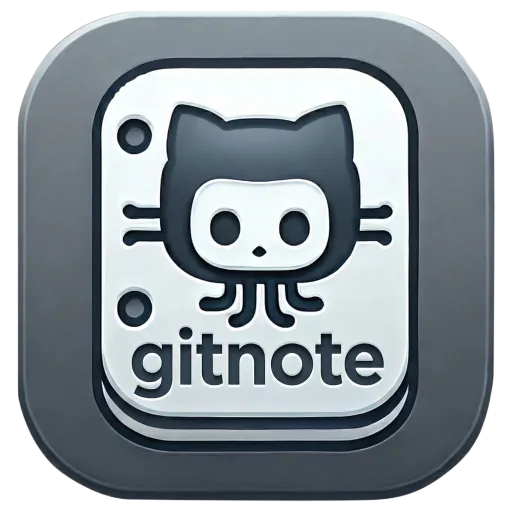
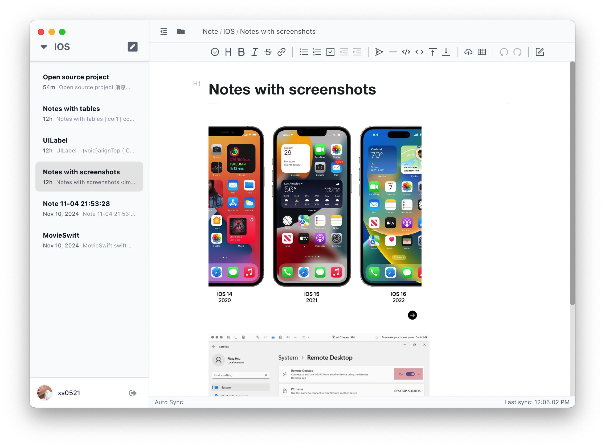
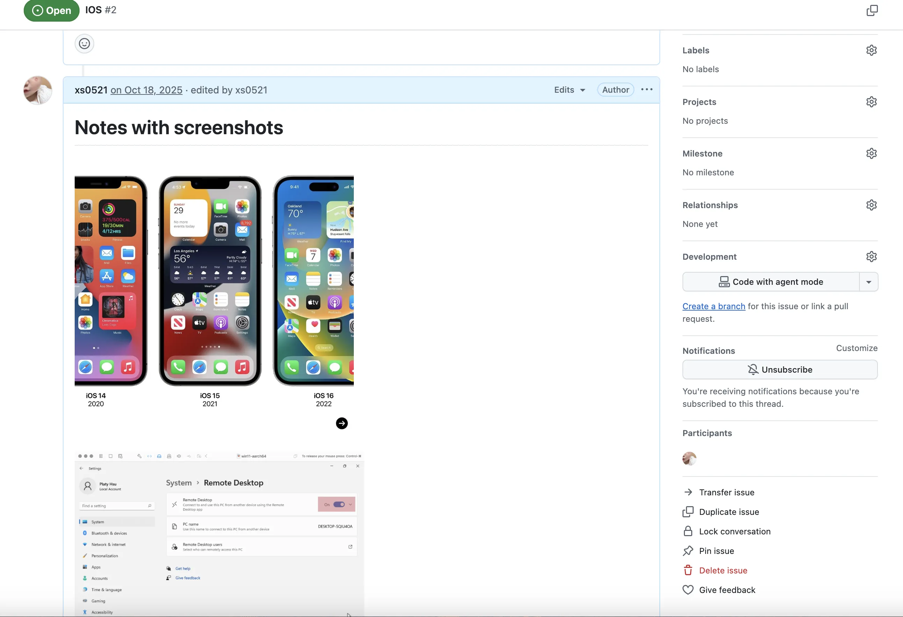

# [GitNote](https://github.com/xs0521/GithubNote)


GitNote is a personal note-taking software with powerful editing capabilities. 

## Screenshot

#### APP


#### GITHUB-WEB


## Summary

### **✨ Real-time Preview**

Write and preview your notes **in real time**.

No lag, no context switching—what you see is what you write.

### **🧠 Powerful Editor**

A **powerful and focused editor** designed for structured notes, long-form writing, and daily knowledge capture.

### **🔒 Never Lose Your Notes**

Your notes are stored in a **GitHub repository you own**.

They will **never be lost**, unless **GitHub shuts down** or **your account is deleted**.

No proprietary cloud. No lock-in. Your data, forever.

### **🌍 Online Access Anywhere**

After syncing, your notes can be **viewed directly on GitHub** anytime, anywhere—without installing GitNote.


------

## **Why GitNote?**

### **GitNote vs. Other Note-Taking Apps (From ChatGPT)** 


| **Feature / App** | **GitNote**     | **Notion**           | **Obsidian**       | **Evernote**         |
| ----------------- | --------------- | -------------------- | ------------------ | -------------------- |
| Real-time preview | ✅ Yes           | ⚠️ Partial            | ❌ No               | ❌ No                 |
| Powerful editor   | ✅ Yes           | ⚠️ Heavy              | ✅ Yes              | ⚠️ Limited            |
| Data ownership    | ✅ Full          | ❌ No                 | ✅ Local only       | ❌ No                 |
| Cloud lock-in     | ❌ None          | ✅ Yes                | ❌ None             | ✅ Yes                |
| Online preview    | ✅ GitHub        | ✅ Yes                | ❌ No               | ✅ Yes                |
| Long-term safety  | ✅ GitHub-backed | ❌ Platform-dependent | ⚠️ Device-dependent | ❌ Platform-dependent |
| Offline-first     | ✅ Yes           | ❌ No                 | ✅ Yes              | ⚠️ Partial            |

### **What Makes GitNote Different?**

- **GitHub is your database**

  GitNote doesn’t invent another cloud. It uses the most reliable developer platform in the world.

- **Your notes outlive the app**

  Even if GitNote disappears, your notes remain readable as plain text in GitHub.

- **Built for permanence, not monetization**

  No subscriptions, no upsells, no closed formats.

------

**GitNote aims to be the last note-taking software you’ll ever need.**

> *As long as GitHub exists, your notes exist.*

------

## Support

System Support： 

## Download

The latest official **installers** and **portable versions** for macOS and windows can be found at [Github Releases](https://github.com/xs0521/GithubNote/releases) page.

## Install

#### Application Signing

*GitNote* is not signed (due to its costs) so you will need to use a workaround for the first run. The workaround depends on if you're running an Intel or Apple Silicon chip.

- **Intel Chips**: [Open a Mac app from an unidentified developer](https://support.apple.com/guide/mac-help/open-a-mac-app-from-an-unidentified-developer-mh40616/mac).
- **Apple Chips**: Open a terminal and run this command:

```
    sudo xattr -r -d com.apple.quarantine /Applications/GitNote.app
```

## Feedback

Find a bug or have a feature request? Please file an <a href="https://github.com/xs0521/GithubNote/issues" targe="_blank">issue</a>!

## Features

- [x] edit (Powered by [vditor](https://github.com/Vanessa219/vditor))
- [x] support private note (Notes are only visible to you.)
- [x] synchronize github
- [x] view notes on the web
- [x] image upload
- [ ] menu

## Update

2026-01-11

- support macOS and windows
- auth snync
- update ui style

2024-11-26

- The first version

## Thanks

Edit by [vditor](https://github.com/Vanessa219/vditor)

## Document

[sync](./SNYC.md)
