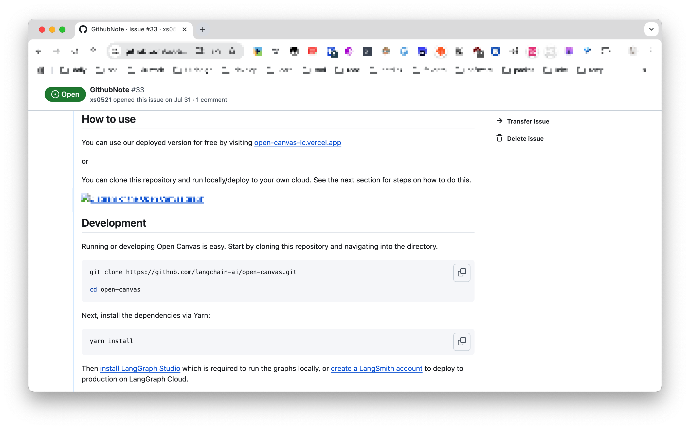
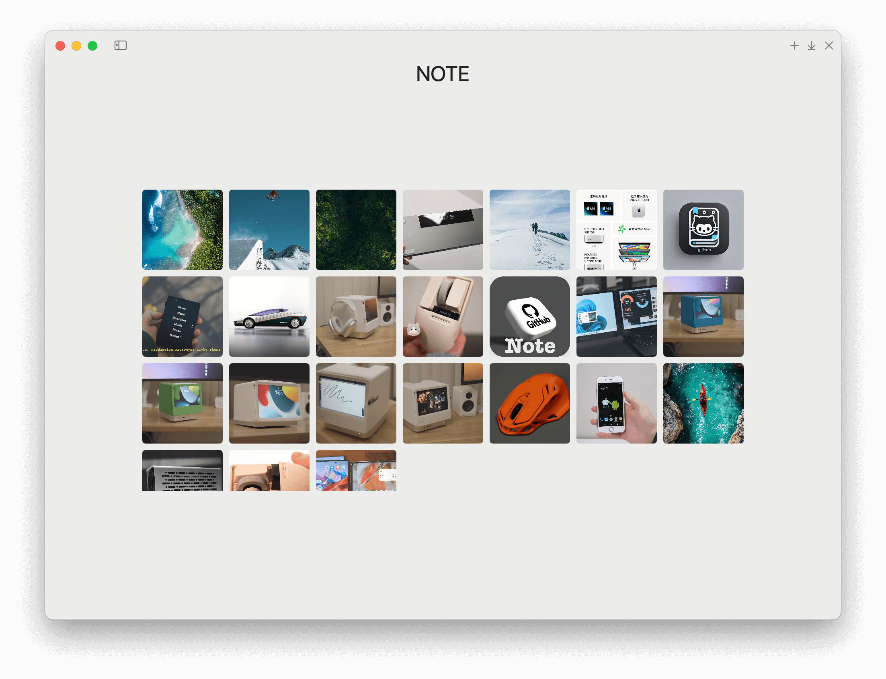

# [GitNote](https://github.com/xs0521/GithubNote)

GitNote is a personal note-taking software with powerful editing capabilities. 

It supports syncing your data to GitHub, ensuring your data is permanently preserved unless the GitHub platform shuts down or your account is deleted. 

Additionally, it offers online preview functionality, allowing you to view your notes on the GitHub platform anytime after syncing. 

We hope it becomes the last note-taking software you'll ever need.

## Screenshot







## Support

System Support：

## Download

The latest official **installers** and **portable versions** for macOS can be found at [Github Releases](https://github.com/xs0521/GithubNote/releases) page.

## Install

#### Application Signing

*GitNote* is not signed (due to its costs) so you will need to use a workaround for the first run. The workaround depends on if you're running an Intel or Apple Silicon chip.

- **Intel Chips**: [Open a Mac app from an unidentified developer](https://support.apple.com/guide/mac-help/open-a-mac-app-from-an-unidentified-developer-mh40616/mac).
- **Apple Chips**: Open a terminal and run this command:

```
    sudo xattr -r -d com.apple.quarantine /Applications/GitNote.app
```

## Feedback

Find a bug or have a feature request? Please file an <a href="https://github.com/xs0521/GithubNote/issues" targe="_blank">issue</a>!

## Features

- [x] edit (Powered by Muya.)
- [x] support private note (Notes are only visible to you.)
- [x] synchronize github
- [x] view notes on the web
- [x] image upload
- [ ] menu

## Update

2024-11-26

- The first version

## Thanks

Edit by [muya](https://github.com/marktext/muya)  

Icon by [rubaitulazad](https://unsplash.com/@rubaitulazad?utm_source=medium&utm_medium=referral)